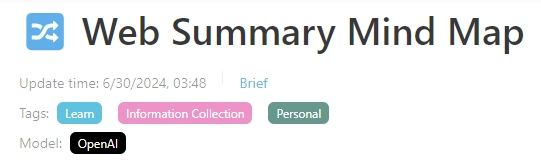
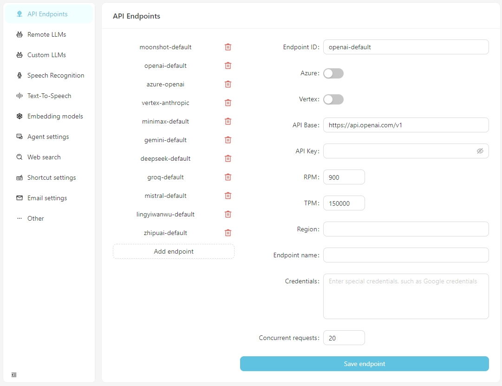
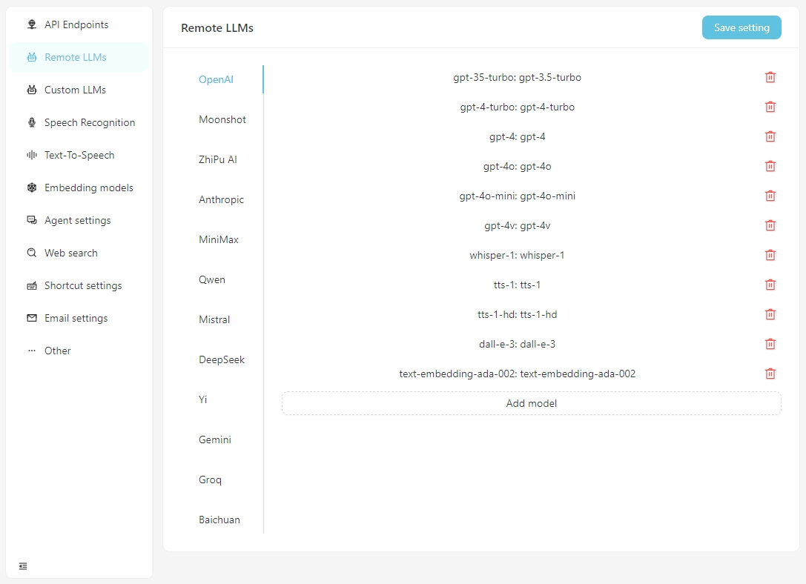
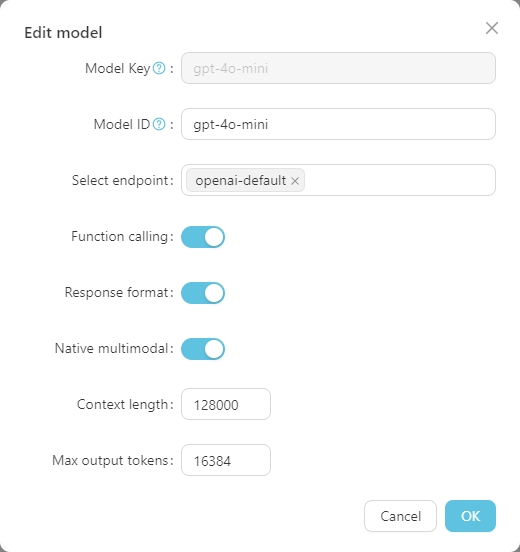
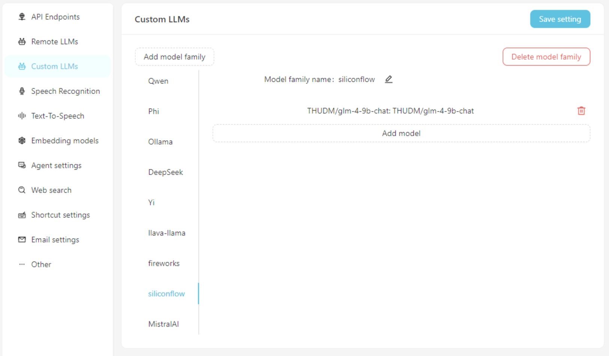
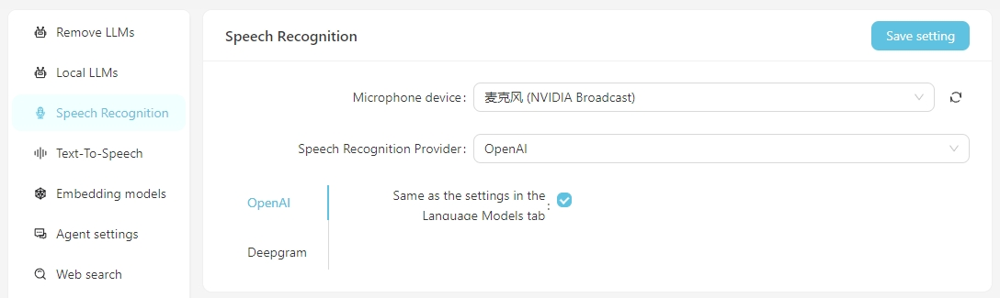
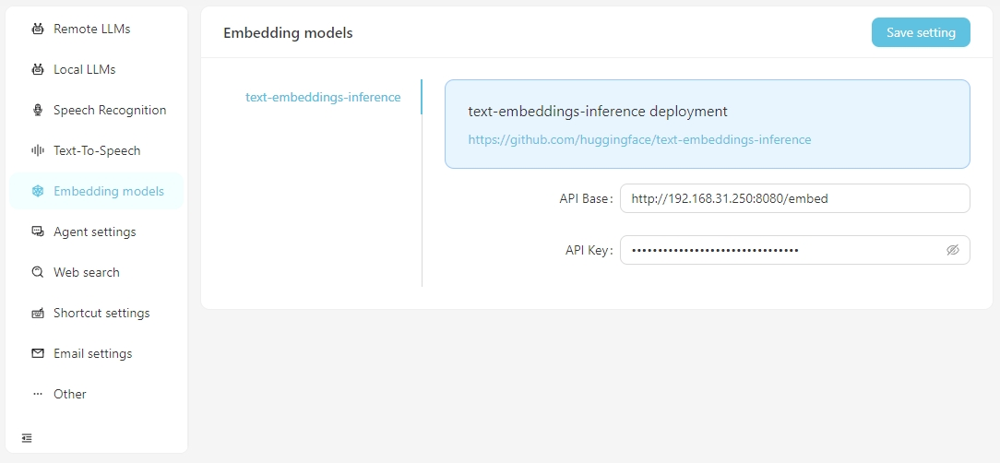
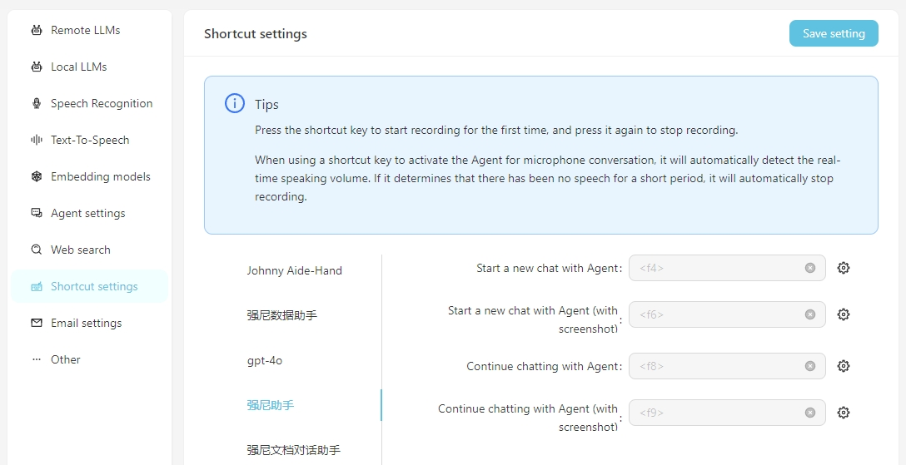

English | [简体中文](README_zh.md) | [日本語](README_ja.md)

[](https://vectorvein.ai)

# 🔀 VectorVein

Build your automation workflow with the power of AI and your personal knowledge base.

Create powerful workflows with just drag and drop, without any programming.

[](https://github.com/AndersonBY/vector-vein)

VectorVein is a no-code AI workflow software inspired by [LangChain](https://github.com/hwchase17/langchain) and [langflow](https://github.com/logspace-ai/langflow), designed to combine the powerful capabilities of large language models and enable users to easily achieve intelligent and automated workflows for various daily tasks.

## 🌐 Online Experience

You can experience VectorVein's online version [here](https://vectorvein.ai/en), with no need to download or install.

Official website [Online Documentation](https://vectorvein.ai/help/docs/introduction)

## 📦 Installation and Configuration

### Installation

After downloading VectorVein from [Release](https://github.com/AndersonBY/vector-vein/releases/), the program will create a "data" folder in the installation directory to store the database and static file resources.

VectorVein is built using pywebview, based on the webview2 kernel, so you need to install the webview2 runtime. If the software cannot be opened, you may need to download the webview2 runtime manually from [https://developer.microsoft.com/en-us/microsoft-edge/webview2/](https://developer.microsoft.com/en-us/microsoft-edge/webview2/)

> [!IMPORTANT]
> If the software cannot be opened after decompression, please check if the downloaded compressed package .zip file is locked. You can solve this problem by right-clicking the compressed package and selecting "Unblock".

### Configuration

Most workflows and agents in the software involve the use of AI large language models, so you should at least provide a usable configuration for a large language model. For workflows, you can see which large language models are being used in the interface, as shown in the image below.



#### API Endpoint Configuration

Starting from v0.2.10, VectorPulse separates API endpoints and large language model configurations, allowing multiple API endpoints for the same large language model.



After the software opens normally, click the open settings button, and you can configure the information for each API endpoint as needed, or add custom API endpoints. Currently, the API endpoints support OpenAI-compatible interfaces, which can be connected to locally running services such as LM-Studio, Ollama, vLLM, etc.

> The API Base for LM-Studio is typically http://localhost:1234/v1/
> 
> The API Base for Ollama is typically http://localhost:11434/v1/

#### Remote Large Language Model Interface Configuration

Please configure the specific information for each model in the `Remote LLMs` tab.



Click on any model to set its specific configuration, as shown below.



The `Model Key` is the standard name of the large model and generally does not need to be adjusted. The `Model ID` is the name used during actual deployment, which usually matches the `Model Key`. However, in deployments like Azure OpenAI, the `Model ID` is user-defined and therefore needs to be adjusted according to the actual situation.

#### Custom Large Language Model Interface Configuration

If using a custom large language model, fill in the custom model configuration information on the `Custom LLMs` tab. Currently, interfaces compatible with OpenAI are supported, such as LM-Studio, Ollama, vLLM, etc.



First, add a custom model family, then add a custom model. Don't forget to click the `Save Settings` button.

#### Speech Recognition Configuration

Currently, the speech recognition services of OpenAI/Deepgram are supported. For OpenAI services, you can use the same configuration as the large language model or set up a speech recognition service compatible with the OpenAI API (such as Groq).



### Embedding Configuration

When you need to perform vector searches using vector data, you have the option to use embedding services provided by OpenAI or configure local embedding services in the `Embedding Model` settings. Currently, supported local embedding services require you to set up [text-embeddings-inference](https://github.com/huggingface/text-embeddings-inference) yourself.



### Shortcut Settings

For ease of daily use, you can configure shortcuts to quickly initiate voice conversations with the Agent. By launching through the shortcut, you can directly interact with the Agent via speech recognition. It is important to ensure that the speech recognition service is correctly configured beforehand.

**Include Screenshot** means that while starting the conversation, a screenshot of the screen will be taken and uploaded as an attachment to the conversation.



### Notes

#### About the local Stable Diffusion API

To use your own local Stable Diffusion API, you need to add the parameter --api to the startup item of webui-user.bat, that is

```
set COMMANDLINE_ARGS=--api
```

## 💻 Usage

### 📖 Basic Concepts

A workflow represents a work task process, including input, output, and how input is processed to reach the output result.

Examples:

- **Translation Workflow**: The input is an English Word document, and the output is also a Word document. You can design a workflow to translate the input Chinese document and generate a Chinese document output.
- **Mind Map Workflow**: If the output of the translation workflow is changed to a mind map, you can get a workflow that reads an English Word document and summarizes it into a Chinese mind map.
- **Web Article Summary Workflow**: If the input of the mind map workflow is changed to a URL of a web article, you can get a workflow that reads a web article and summarizes it into a Chinese mind map.
- **Automatic Classification of Customer Complaints Workflow**: The input is a table containing complaint content, and you can customize the keywords that need to be classified, so that the complaints can be automatically classified. The output is an automatically generated Excel table containing the classification results.

### 🔎 User Interface

Each workflow has a **User Interface** and an **Editor Interface**. The user interface is used for daily workflow operations, and the editor interface is used for workflow editing. Usually, after designing a workflow, you only need to run it in the user interface and do not need to modify it in the editor interface.


The user interface is shown above and is divided into three parts: input, output, and trigger (usually a run button). You can directly enter content for daily use, click the run button to see the output result.

To view the executed workflow, click **Workflow Run Records**, as shown in the following figure.


### ✏️ Creating a Workflow

You can add our official templates to your workflow or create a new one. It is recommended to familiarize yourself with the use of workflows using official templates at the beginning.


The workflow editor interface is shown above. You can edit the name, tags, and detailed description at the top. The left side is the node list of the workflow, and the right is the canvas of the workflow. You can drag the desired node from the left side to the canvas, and then connect the node through the wire to form a workflow.

You can view a tutorial on creating a simple crawler + AI summary mind map workflow [here](TUTORIAL.md).

You can also try this [online interactive tutorial](https://vectorvein.ai/workspace/workflow/editor/tutorial).

## 🛠️ Development and Deployment

### Environment Requirements

- Backend
  - Python 3.8 ~ Python 3.11
  - [PDM](https://pdm.fming.dev/latest/#installation) installed

- Frontend
  - Vue3
  - Vite

### Project Development

Run the following command in the **backend** directory to install dependencies:

#### Windows
```bash
pdm install
```

#### Mac
```bash
pdm install -G mac
```

Normally, PDM will automatically find the system's Python and create a virtual environment and install dependencies.

After installation, run the following command to start the backend development server and see the running effect:

```bash
pdm run dev
```

If you need to modify the frontend code, you need to run the following command in the **frontend** directory to install dependencies:

```bash
pnpm install
```

> When pulling the project code for the first time, you also need to run `pnpm install` to install the front-end dependencies.
>
> If you don't need to develop any front-end code at all, you can directly copy the `web` folder from the release version into the `backend` folder.

After the frontend dependencies are installed, you need to compile the frontend code into the static file directory of the backend. A shortcut instruction has been provided in the project. Run the following command in the **backend** directory to pack and copy the frontend resources:

```bash
pdm run build-front
```

### Database Structure Changes

> [!WARNING]
> Before making changes to the database structure, please back up your database (located at `my_database.db` in your configured `data` directory), otherwise you may lose data.

If you have modified the model structure in `backend/models`, you need to run the following commands in the `backend` directory to update the database structure:

First, enter the Python environment:

```bash
pdm run python
```

```python
from models import create_migrations
create_migrations("migration_name")  # Name according to the changes made
```

After the operation, a new migration file will be generated in the `backend/migrations` directory, with the filename format `xxx_migration_name.py`. It is recommended to check the content of the migration file first to ensure it is correct, and then restart the main program. The main program will automatically execute the migration.

### Software Packaging

The project uses pyinstaller for packaging. Run the following command in the **backend** directory to package it into an executable file:

```bash
pdm run build
```

After packaging, the executable file will be generated in the**backend/dist** directory.

## 📄 License

VectorVein is an open-source software that supports personal non-commercial use. Please refer to [LICENSE](LICENSE.md) for specific agreements.
