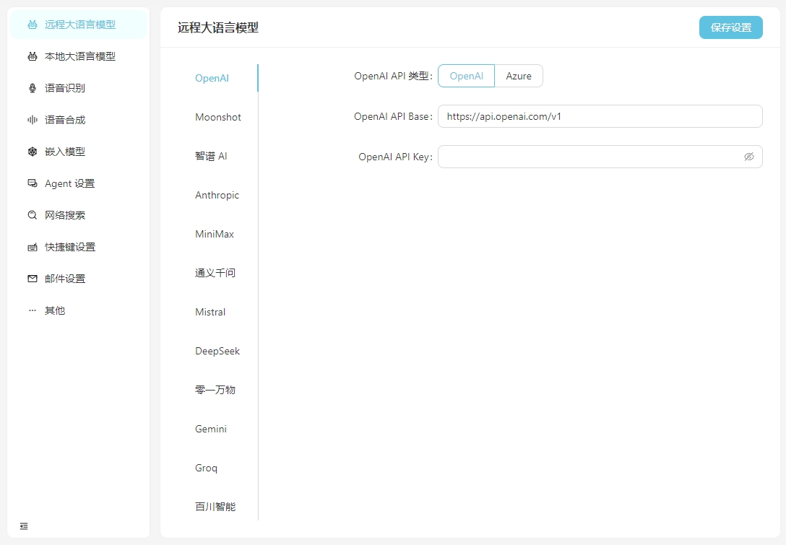
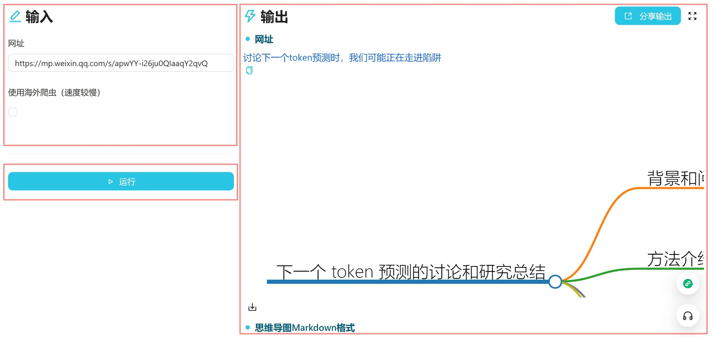
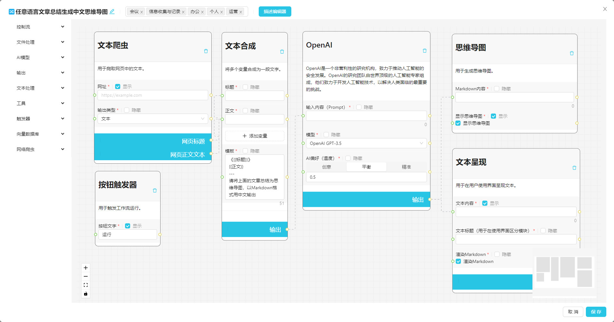

 [English](README_en.md) | 简体中文

 [](https://vectorvein.com)

# 🔀 向量脉络 VectorVein

利用 AI 的力量构建您的个人知识库+自动化工作流程。

无需编程，只需拖拽即可创建强大的工作流，自动化所有任务。

 [](https://github.com/AndersonBY/vector-vein)

向量脉络是受到 [LangChain](https://github.com/hwchase17/langchain) 以及 [langflow](https://github.com/logspace-ai/langflow) 的启发而开发的无代码 AI 工作流软件，旨在结合大语言模型的强大能力并让用户通过简单的拖拽即可实现各类日常工作流的智能化和自动化。

## 🌐 在线体验

您可以在 [这里](https://vectorvein.com) 体验向量脉络的在线版本，无需下载安装。

官方网站 [在线文档](https://vectorvein.com/help/docs/introduction)

## 📦 安装及配置

### 安装

在 [Release 页下载](https://github.com/AndersonBY/vector-vein/releases/) 后打开 VectorVein 软件，初次打开时程序会在安装目录下创建 data 文件夹，用于存放数据库及静态文件资源。

软件采用了 pywebview 搭建，基于 webview2 内核，因此需要安装 webview2 运行时，如果出现软件无法打开，可能需要手动下载 webview2 运行时，下载地址： [https://developer.microsoft.com/zh-cn/microsoft-edge/webview2/](https://developer.microsoft.com/zh-cn/microsoft-edge/webview2/)

### 配置

软件正常打开后点击打开设置按钮，请填入 OpenAI 的 API Key 以使用 AI 功能，并选择输出文件夹用于存放工作流输出时的文件。如果需要用到邮件发送的功能请在设置页面一并填入邮箱信息。



### 注意事项

#### 关于本地的 Stable Diffusion API

为了能够使用您自己本地运行的 Stable Diffusion API，您需要在 webui-user.bat 的启动项加上参数 --api，即

```
set COMMANDLINE_ARGS=--api
```

## 💻 使用方式

### 📖 基本概念

一个工作流代表了一个工作任务流程，包含了输入、输出以及工作流的触发方式。你可以任意定义输入是什么，输出是什么，以及输入是如何处理并到达输出结果的。

几个例子：

-   **翻译工作流**，输入是一个英文的 Word 文档，输出也是 Word 文档，你可以设计工作流将输入的中文文档翻译后生成中文文档。
-   **思维导图工作流**，如果将翻译工作流的输出改为思维导图，那么你就可以得到一个读取英文 Word 文档并总结为中文思维导图的工作流。
-   **网络文章摘要工作流**，如果将思维导图工作流的输入改为网络文章的 URL，那么你就可以得到一个读取网络文章并总结为中文思维导图的工作流。
-   **客户差评自动分类工作流**，输入是一个包含差评内容的表格，并自定义需要分类的关键词，即可自动将差评分类，输出就是自动生成包含分类结果的 Excel 表格。

### 🔎 使用界面

每个工作流都有一个**使用界面**和一个**编辑界面**，使用界面用于日常运行工作流，编辑界面用于编辑工作流。通常而言一个设计好的工作流您平时只需要在使用界面中运行即可，不需要再去编辑界面中修改。



使用界面如上所示，分为输入、输出、触发器 ( 通常是一个运行按钮 ) 三个部分。日常使用可以直接输入内容，点击运行按钮即可在输出看到结果。

想查看运行过的工作流可以点击【工作流运行记录】，如下图所示。


### ✏️ 创建工作流

您可以添加我们提供的官方模板到自己的工作流中，也可以自己创建一个新的工作流。刚开始时建议先用官方模板熟悉一下工作流的使用。



工作流编辑界面如上图所示，顶部可以编辑名称、标签以及详细描述。左侧是工作流的节点列表，右侧是工作流的画布，您可以从左侧找到想要的节点拖拽到画布中，然后通过连线连接节点，形成工作流。

您可以查看一个简易的 爬虫 + AI 总结思维导图工作流的 [创建教学](TUTORIAL.md) 。

还可以试一下这个 [在线互动教程](https://vectorvein.com/workspace/workflow/editor/tutorial) 。

## 🛠️ 开发部署

### 环境要求

- 后端
  - Python 3.8 ~ Python 3.11
  - 安装 [PDM](https://pdm.fming.dev/latest/#installation)

- 前端
  - Vue3
  - Vite

### 项目开发

在 **backend** 目录下运行以下命令安装依赖：

#### Windows
```bash
pdm install
```

#### Mac
```bash
pdm install -G mac
```

正常来说 PDM 会自动找到系统的 Python 并创建虚拟环境以及安装依赖。

安装完成后运行以下命令启动后端开发服务即可看到运行效果：

```bash
pdm run dev
```

如果需要修改前端代码，需要在 **frontend** 目录下运行以下命令安装依赖：

```bash
pnpm install
```

前端依赖安装完成后需要将前端代码编译到后端的静态文件目录中，项目已提供了快捷指令，在 **backend** 目录下运行以下命令实现前端资源打包及拷贝：

```bash
pdm run build-front
```

### 软件打包

项目采用 pyinstaller 进行打包，在 **backend** 目录下运行以下命令即可打包成可执行文件：

```bash
pdm run build
```

打包完成后会在 **backend/dist** 目录下生成可执行文件。

## 📄 协议

向量脉络是一个开源的软件，支持个人非商业使用，具体协议请参考 [LICENSE](LICENSE.md) 。
