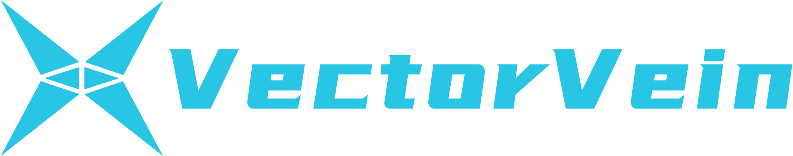
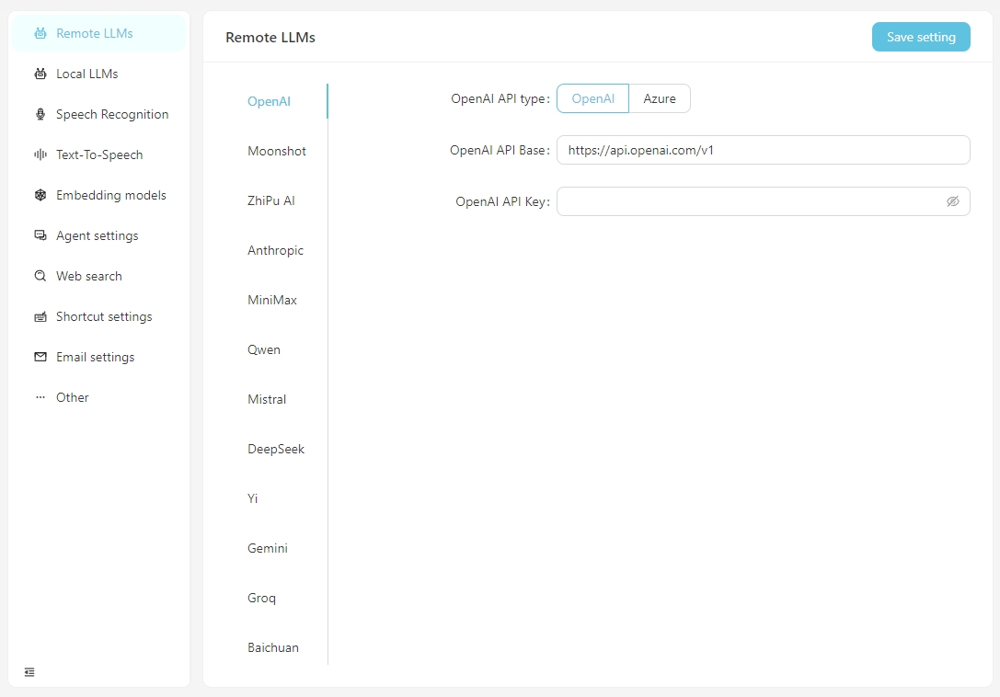
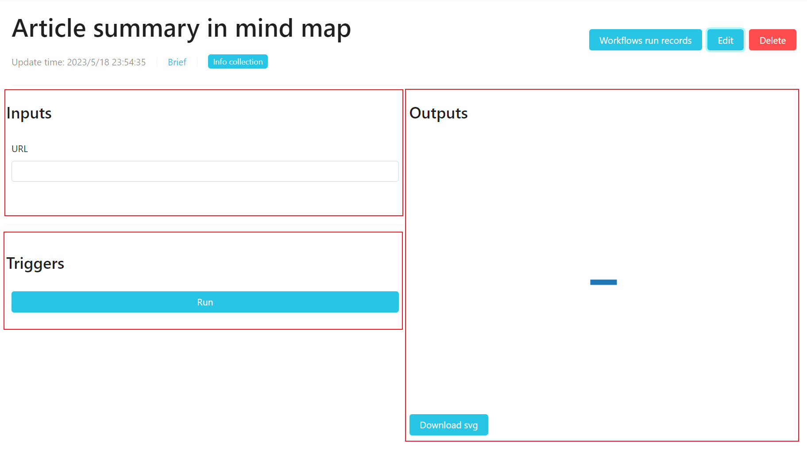
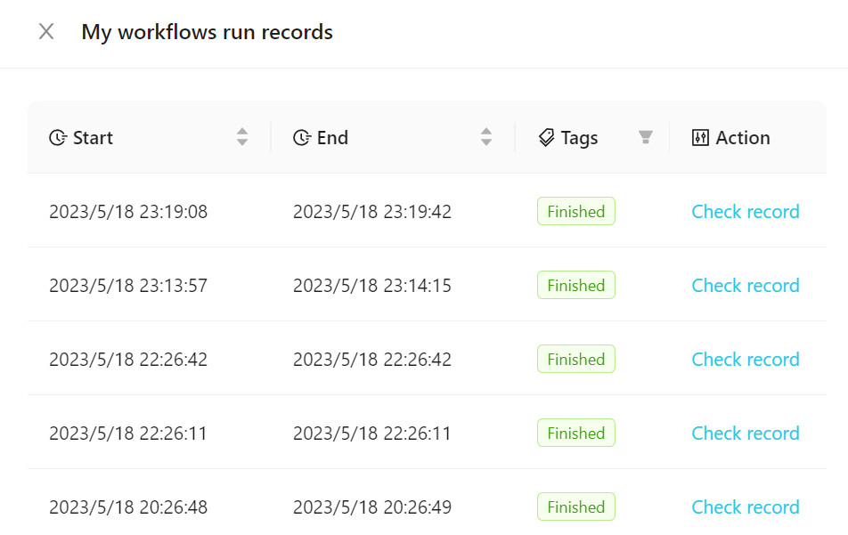
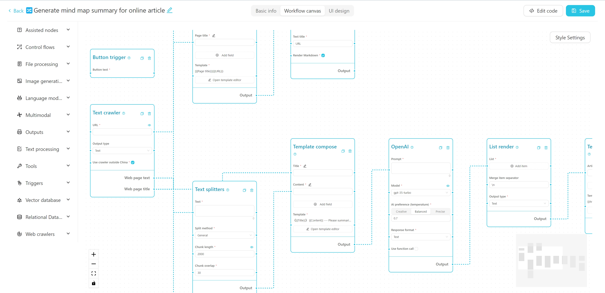

English | [简体中文](README_en.md)

[](https://vectorvein.com)

# 🔀 VectorVein

Build your automation workflow with the power of AI and your personal knowledge base.

Create powerful workflows with just drag and drop, without any programming.

[](https://github.com/AndersonBY/vector-vein)

VectorVein is a no-code AI workflow software inspired by [LangChain](https://github.com/hwchase17/langchain) and [langflow](https://github.com/logspace-ai/langflow), designed to combine the powerful capabilities of large language models and enable users to easily achieve intelligent and automated workflows for various daily tasks.

## 🌐 Online Experience

You can experience VectorVein's online version [here](https://vectorvein.com/en), with no need to download or install.

Official website [Online Documentation](https://vectorvein.com/help/docs/introduction)

## 📦 Installation and Configuration

### Installation

After downloading VectorVein from [Release](https://github.com/AndersonBY/vector-vein/releases/), the program will create a "data" folder in the installation directory to store the database and static file resources.

VectorVein is built using pywebview, based on the webview2 kernel, so you need to install the webview2 runtime. If the software cannot be opened, you may need to download the webview2 runtime manually from [https://developer.microsoft.com/en-us/microsoft-edge/webview2/](https://developer.microsoft.com/en-us/microsoft-edge/webview2/)

### Configuration

After opening the software normally, click the "Open Settings" button and fill in the OpenAI API Key to enable the AI function. Also, select the output folder to store the output files of the workflow. If you need to use the email sending function, please also fill in the email information in the settings page.



### Notes

#### About the local Stable Diffusion API

To use your own local Stable Diffusion API, you need to add the parameter --api to the startup item of webui-user.bat, that is

```
set COMMANDLINE_ARGS=--api
```

## 💻 Usage

### 📖 Basic Concepts

A workflow represents a work task process, including input, output, and how input is processed to reach the output result.

Examples:

- **Translation Workflow**: The input is an English Word document, and the output is also a Word document. You can design a workflow to translate the input Chinese document and generate a Chinese document output.
- **Mind Map Workflow**: If the output of the translation workflow is changed to a mind map, you can get a workflow that reads an English Word document and summarizes it into a Chinese mind map.
- **Web Article Summary Workflow**: If the input of the mind map workflow is changed to a URL of a web article, you can get a workflow that reads a web article and summarizes it into a Chinese mind map.
- **Automatic Classification of Customer Complaints Workflow**: The input is a table containing complaint content, and you can customize the keywords that need to be classified, so that the complaints can be automatically classified. The output is an automatically generated Excel table containing the classification results.

### 🔎 User Interface

Each workflow has a **User Interface** and an **Editor Interface**. The user interface is used for daily workflow operations, and the editor interface is used for workflow editing. Usually, after designing a workflow, you only need to run it in the user interface and do not need to modify it in the editor interface.



The user interface is shown above and is divided into three parts: input, output, and trigger (usually a run button). You can directly enter content for daily use, click the run button to see the output result.

To view the executed workflow, click **Workflow Run Records**, as shown in the following figure.



### ✏️ Creating a Workflow

You can add our official templates to your workflow or create a new one. It is recommended to familiarize yourself with the use of workflows using official templates at the beginning.



The workflow editor interface is shown above. You can edit the name, tags, and detailed description at the top. The left side is the node list of the workflow, and the right is the canvas of the workflow. You can drag the desired node from the left side to the canvas, and then connect the node through the wire to form a workflow.

You can view a tutorial on creating a simple crawler + AI summary mind map workflow [here](TUTORIAL_en.md).

You can also try this [online interactive tutorial](https://vectorvein.com/workspace/workflow/editor/tutorial).

## 🛠️ Development and Deployment

### Environment Requirements

- Backend
  - Python 3.8 ~ Python 3.11
  - [PDM](https://pdm.fming.dev/latest/#installation) installed

- Frontend
  - Vue3
  - Vite

### Project Development

Run the following command in the **backend** directory to install dependencies:

#### Windows
```bash
pdm install
```

#### Mac
```bash
pdm install -G mac
```

Normally, PDM will automatically find the system's Python and create a virtual environment and install dependencies.

After installation, run the following command to start the backend development server and see the running effect:

```bash
pdm run dev
```

If you need to modify the frontend code, you need to run the following command in the **frontend** directory to install dependencies:

```bash
pnpm install
```

After the frontend dependencies are installed, you need to compile the frontend code into the static file directory of the backend. A shortcut instruction has been provided in the project. Run the following command in the **backend** directory to pack and copy the frontend resources:

```bash
pdm run build-front
```

### Software Packaging

The project uses pyinstaller for packaging. Run the following command in the **backend** directory to package it into an executable file:

```bash
pdm run build
```

After packaging, the executable file will be generated in the**backend/dist** directory.

## 📄 License

VectorVein is an open-source software that supports personal non-commercial use. Please refer to [LICENSE](LICENSE.md) for specific agreements.