After experimenting with some pre-made workflow templates, you might want to create your own. This guide will assist you in that process.

You can also directly try our interactive tutorial [online](https://vectorvein.ai/workspace/workflow/tutorial).

## ✌️ General Approach

#### UI Design

First and foremost, when designing workflows, the goal is to make similar future processes more efficient. Therefore, consider what information might change each time the workflow runs. Extract this mutable information as inputs for each workflow execution, while static information can be hardcoded during editing and hidden from the user interface.

The design on the left in the image below is less concise than the right, as the template information remains constant and doesn't need to be displayed.

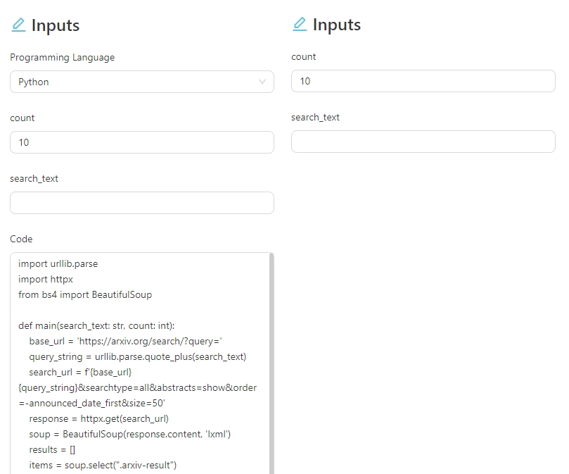

#### Workflow Development Philosophy

When starting to design a workflow, avoid trying to do everything at once. Begin with a simple version containing just a few nodes, then iterate gradually. Always test the workflow after adding and connecting a few nodes to check for issues before proceeding. This approach helps you identify problems earlier in the development process, saving time compared to finding them after completion.

## 🏫 Rapid Development Tutorial

I'll demonstrate how to quickly develop a workflow using a simple **Translation + AI Summary Mind Map** example. Through this tutorial, you'll learn the basics of the workflow editor and some fundamental concepts, along with some best practices.

1. Create a new empty workflow and click **More Actions** -> **Edit** on the workflow details page to open the editor.

2. From the left panel, drag the **Trigger > Button Trigger** node onto the canvas.

3. Next, find the **Output > Text** node and drag it onto the canvas.

4. In the **Text** node's text content handle, type a message like `Hello`, and in the text title handle, write a title such as `Output Title`.

At this point, your canvas should look like this:
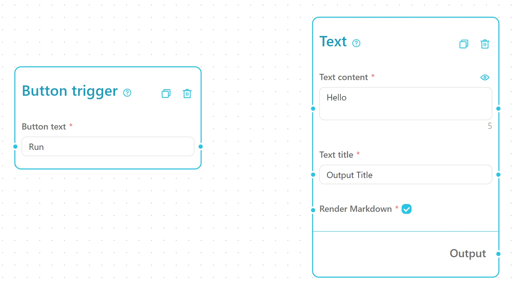

> Note: The **Button Trigger** usually just needs to be placed on the canvas. It functions as a special node that **doesn't require** connection to other nodes.
>
> Note: The **Text Title** in **Text** node is used as a title that appears in the user interface. When you have multiple text contents to display, you can use this title to differentiate them.

Let's now click on **UI Design** to preview the user interface. You'll notice a button in the trigger area and some text content in the output area, as shown in the following image:
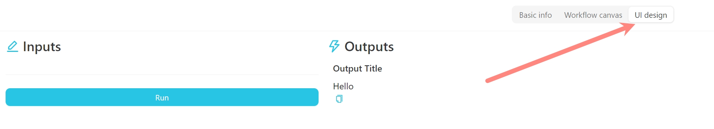

Next, return to the **Workflow Canvas** page and find the **Text Processing -> Template Compose** node from the left panel. Drag it onto the canvas. The **Template Compose** node combines multiple text contents into a single text based on a predefined template. The canvas should now look like this:
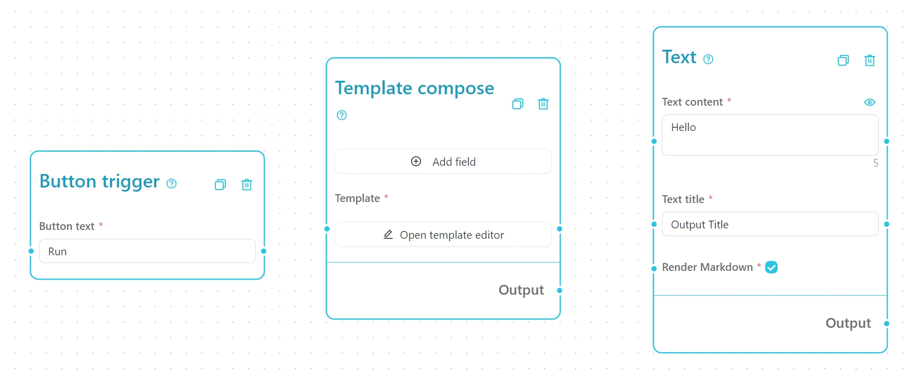

Click on the **Template Compose** node to add variables. In the opened drawer, enter a variable name `Title` and click **Add**. Then, input another variable name `Body`, select the input type as a multi-line text box, and click **Add**. Your **Template Compose** node should now appear as follows:
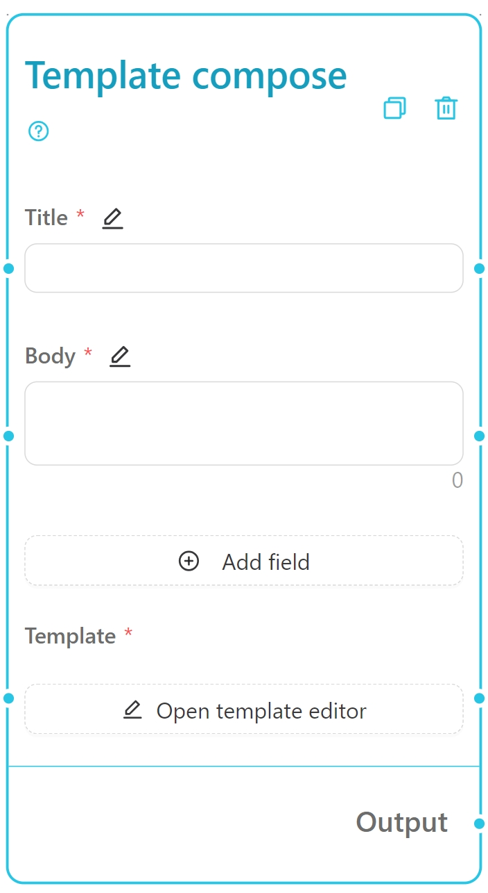

Now, write some content in the template to indicate how to concatenate the text into the desired format. When using variables in the template, use the `{{variable_name}}` syntax. For example, to combine the title and the body into a complete text, the template could be written like this:

```
{{Title}}

---

{{Body}}
```

This combines the title and body into a complete text content. Your **Template Compose** node should now look like this:
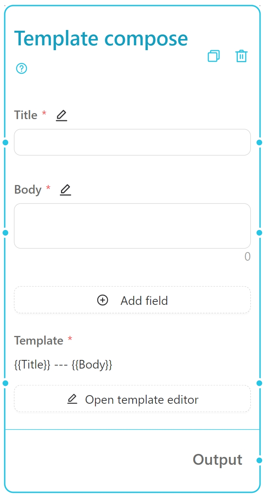

> Note: The variable names in the template must match the ones you defined above. Otherwise, the concatenation will fail.
>
> Tip: You can drag the variable names and inserted into the template.

Next, drag an output cable from the **Template Compose** node to the **Text** node's text content handle. This connection in the workflow signifies that the text content generated by the **Template Compose** node will be input to the **Text** node's text content handle. Your canvas should now resemble this:
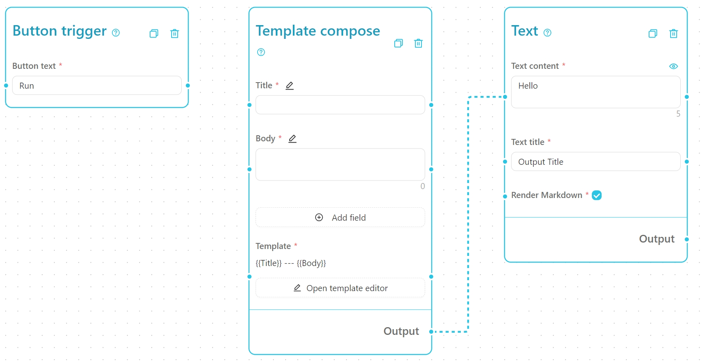

Now, click to enable the eyeball icons for the title and body on the right, and click **Save** to return to the interface. Enter a title and body in the input box, then run the workflow. The synthesized result will appear on the right, as shown below. This is a simple Template Compose workflow. The title and body we input on the left replace the placeholders in the template, which are then combined into a complete text and displayed in the right-hand text content area.
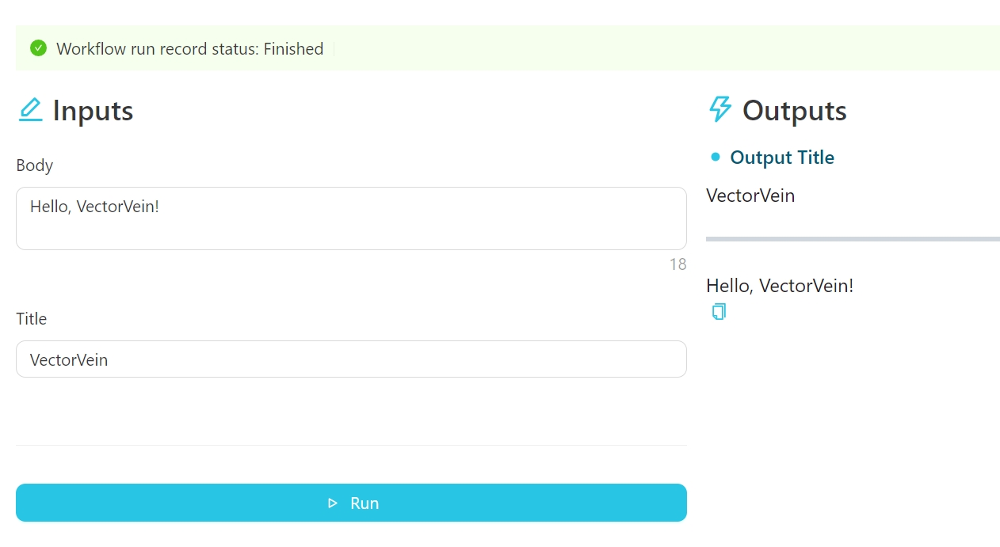

> Note: If you look closely, you'll notice that the **Text** node's text content handle originally contained the words `Hello`. However, these don't appear after running the workflow. This is because the output from the **Template Compose** node is connected to the **Text** node's text content handle, so the workflow uses that content during execution. If no connection exists, it would display the node's default content.

Let's continue by adding a web scraping feature. From the left, find the **Web Crawlers -> Text Crawler** node and drag it onto the canvas. Then, connect the **Text Crawler**'s webpage title and webpage body text outputs to the **Template Compose** node's title and body inputs, respectively. Disable the eyeball icons for the title and body on the **Template Compose** node. Your canvas should now look like this:
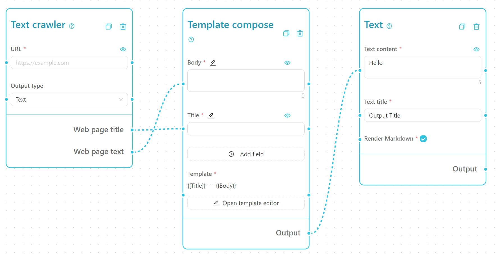

Click the **Save** button to return to the interface. Enter a URL in the input box (for example: [What is Azure OpenAI Service?](https://learn.microsoft.com/en-us/azure/ai-services/openai/overview)) and click **Run**. The scraped webpage title and main content will combine to display on the right, as shown in the following image. This is a simple workflow for a text crawler.
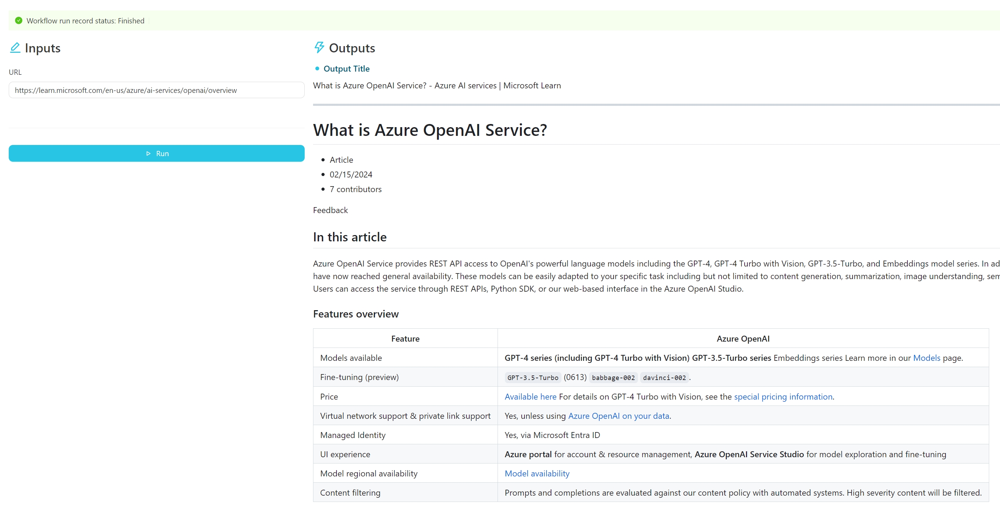

Reopen the editing page. Next, we need to modify the template for template compose to turn it into an AI prompt. Change the template of the **Template Compose** node to the following content:

```markdown
# {{Title}}
{{Body}}

---

Summary:
```

> Note: In most cases, we use template compose to create automated prompt templates for AI models to generate content.

Now, we'll add the crucial AI component, dragging the **LLMs -> OpenAI** node (feel free to try other AI models) into the flow and positioning it between the **Template Compose** and **Text** nodes.

Next, we need to change the connection from **Template Compose** to **Text** to the **Input Prompt** handle of the **OpenAI** node. To alter the connection, place the cursor near the endpoint, wait for the cursor to turn into a crosshair, then press and hold the left mouse button to drag the connection to the desired handle, and release the mouse button. Here's a visual guide:
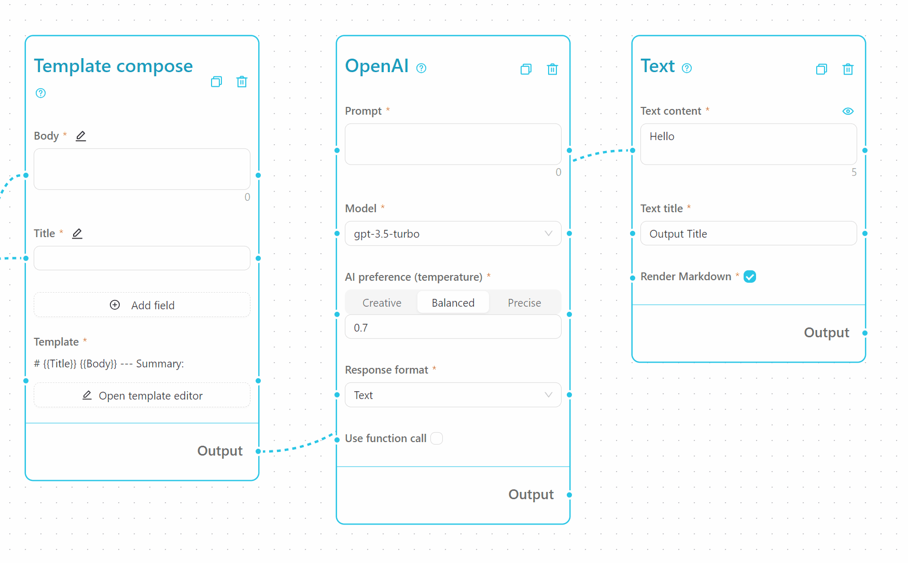

> Note: To delete a connection, select it and press the Backspace key on your keyboard.

Make sure your canvas nodes resemble the layout below, then save the workflow and return to the user interface:
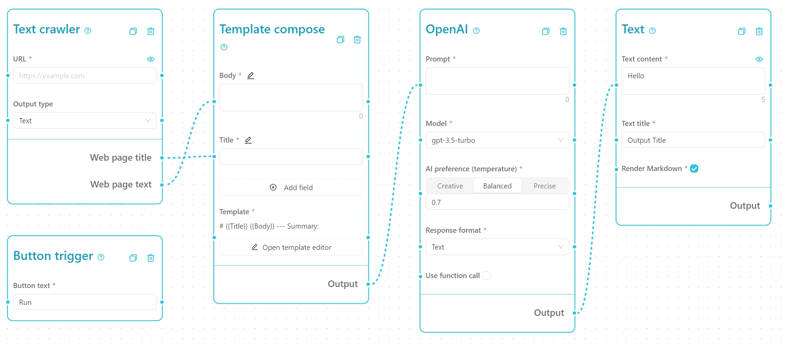

With a URL of an article input, running the workflow will generate an AI-created article summary, as shown below. This is a basic workflow for AI-generated article summarization.
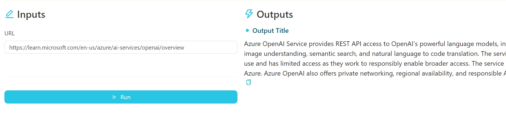

> Note: In this simple workflow, we don't have a specific handling for long articles, so if the linked content is too long, the AI model might not process it, leading to no output. If you're interested in handling long articles, check out the official workflow templates for a solution, like the **🔀 Web Summary Mind Map**.

Back in the editing page, let's extend the workflow to output both Markdown text and a mind map. Drag the **Output -> Mind Map** node into the flow, then connect a new line from the **OpenAI** node's output handle to the **Mind Map** node's Markdown content handle, as shown below:


To enable the AI model to generate a hierarchical mind map, modify the **Template Compose** node's template content:
```markdown
{{Title}}
{{Body}}

---

Please summarize the above article into a multi-level mind map using Markdown format.
```

> Note: To achieve the best output, you may need to adjust the test template content multiple times. For example, we deliberately added a keyword `multi-level` here, so the AI model will be more inclined to output a hierarchical, multi-level mind map.

After saving and rerunning the workflow, you can get an AI-generated Markdown-format mind map, as shown in the figure below. This is a simple crawler + AI mind map workflow.
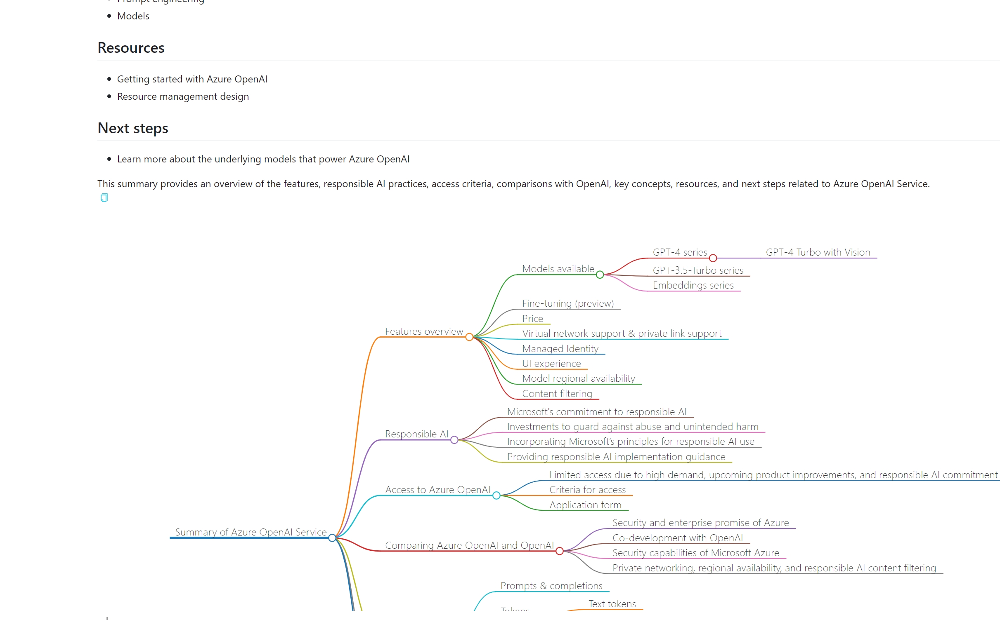

For a well-designed workflow, don't forget to modify the name, tags, and description in the upper left corner for easier future access.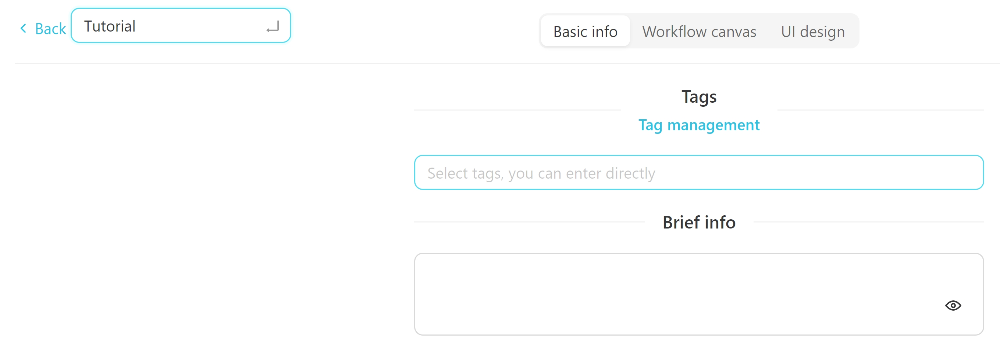