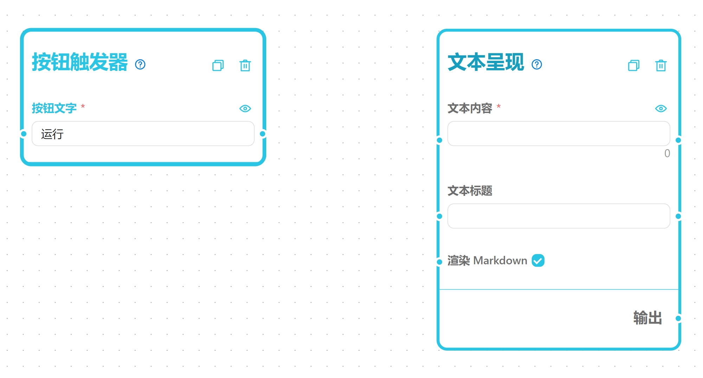
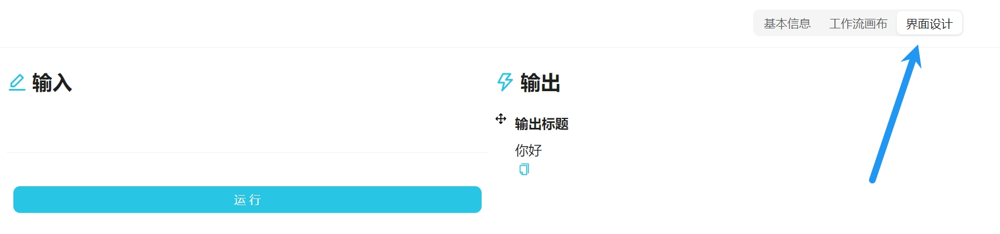
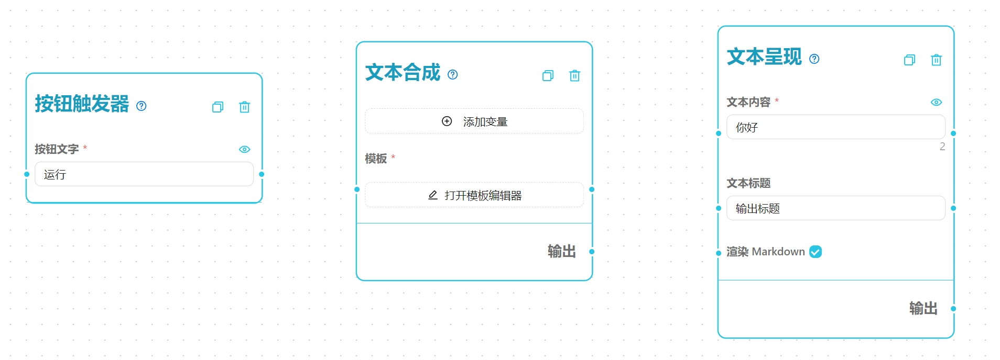
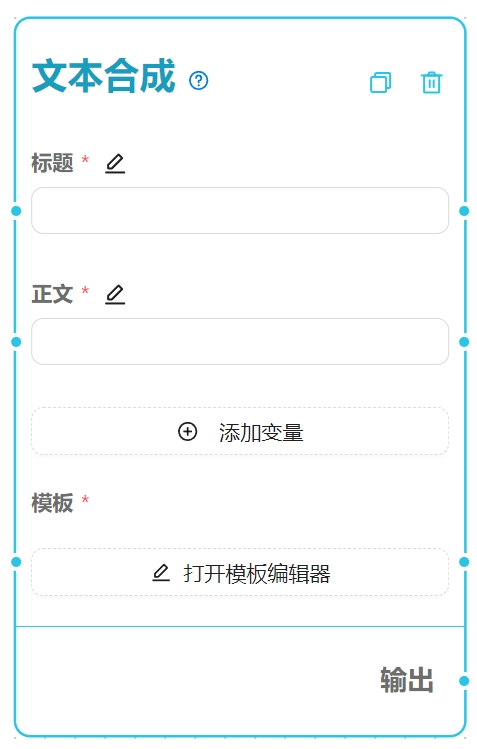
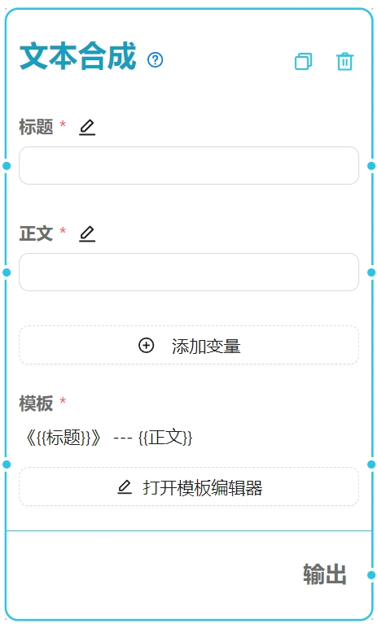
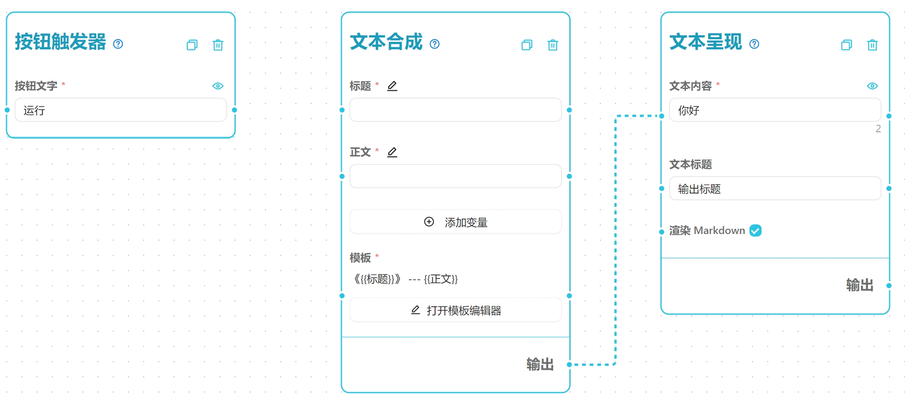
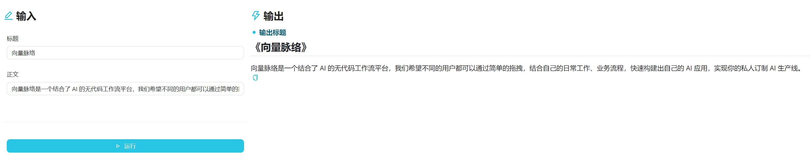

# 向量脉络工作流创建教学

1. 创建一个新的空工作流，打开编辑页面。
2. 从左侧找到**触发器->按钮触发器**节点，拖拽到画布中。
3. 从左侧找到**网络爬虫->文本爬虫**节点，拖拽到画布中。
4. 从左侧找到**输出->文本呈现**节点，拖拽到画布中。目前您的画布应该是这样的：
5. **按钮触发器**只需要放置在画布上即可，它作为特殊的节点不需要与其它节点连接。
6. 现在将**文本爬虫**节点的网页正文文本端口拖出一根线连接到**文本呈现**节点的文本内容端口，目前您的画布应该是这样的：
7. **文本呈现**中的**文本标题**是用于显示在使用界面的标题，当您的输出中有多个文本内容需要呈现时可通过这个标题来进行区分。
8. 现在点击**保存**按钮回到使用界面，在输入框中输入一个网址并点击运行，即可得到爬虫爬取的结果呈现在右边，效果如下图所示，这就是一个简单的爬虫工作流：
9. 重新点开编辑页面，双击连线删除连线，找到**文本处理->文本合成**拖入画布，点击文本合成节点的添加变量，分别添加两个变量，显示名称一个是`标题`，一个是`正文`，然后将**文本爬虫**的**网页标题**端口拖出一根线连接到**文本合成**的**标题**端口，将**文本爬虫**的**网页正文文本**端口拖出一根线连接到**文本合成**的**正文**端口，目前您的画布应该是这样的：
10. 在**文本合成**节点的模板中输入下面的内容，工作流运行时会将{{变量}}替换为连线来源端口的内容，合成后的模板会作为**文本合成**节点的输出。
```
《{{标题}}》
{{正文}}
---
总结上面的文章为思维导图，以Markdown格式输出。
```

11. 我们将合成后的输出作为交给AI的输入（Prompt），把**AI模型->OpenAI**节点拖到画布里，把**文本合成**的输出端口拖出一根线连到**OpenAI**节点的输入内容端口，目前您的画布应该是这样的：
12. 把**输出->思维导图**拖进来，把OpenAI的输出多扣拖出一根线连到**思维导图**的文本内容端口，并且再拖一根线连接到**文本呈现**的文本内容端口，目前您的画布应该是这样的：
13. 点击保存按钮回到使用界面，输入一个网址并点击运行，即可得到爬虫爬取后被AI总结的思维导图结果结果呈现在右边，效果如下图所示，这就是一个简单的爬虫+AI总结工作流：