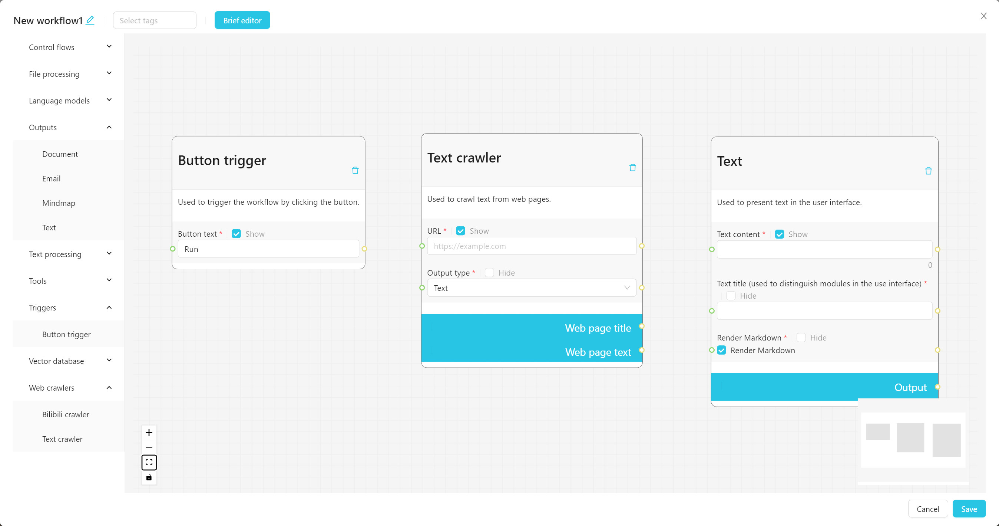
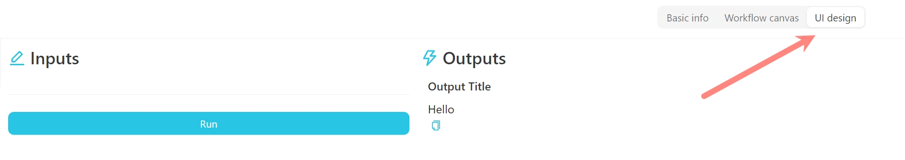
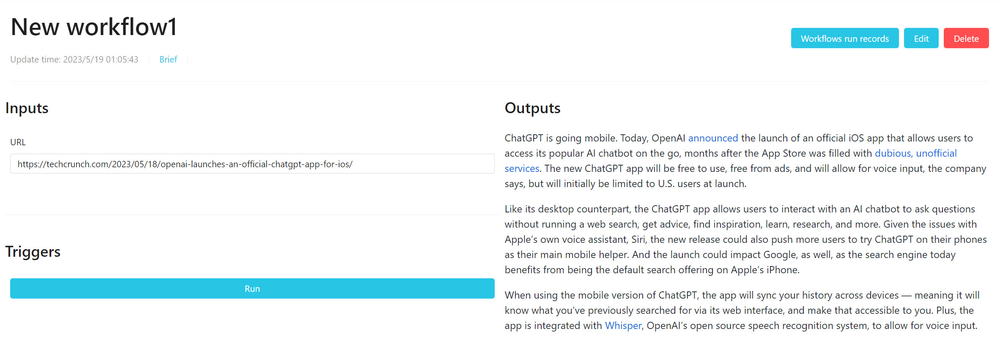
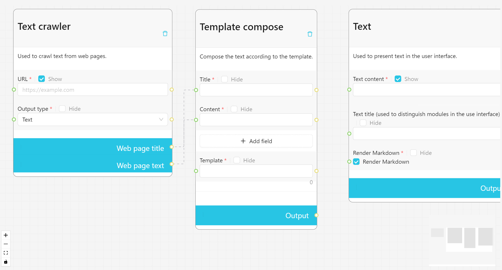
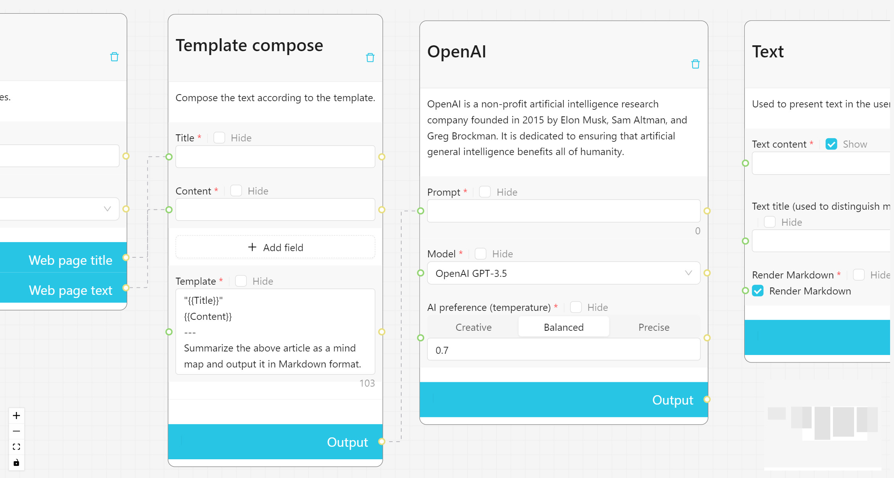
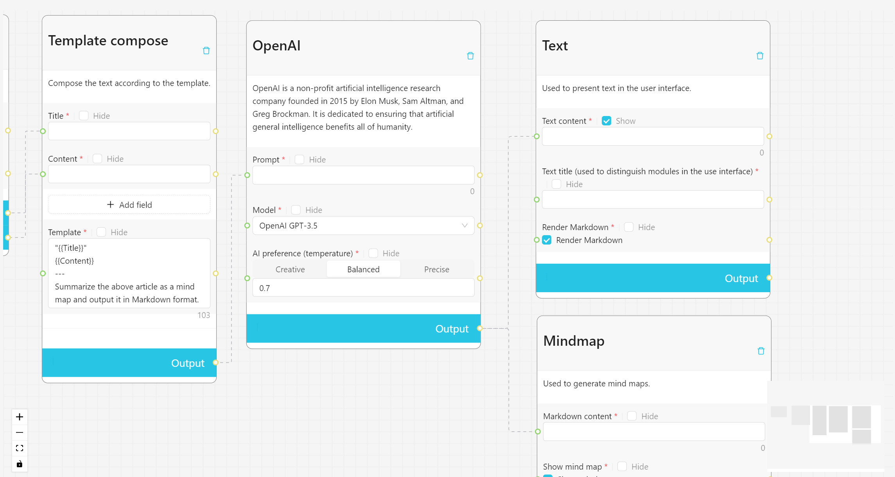
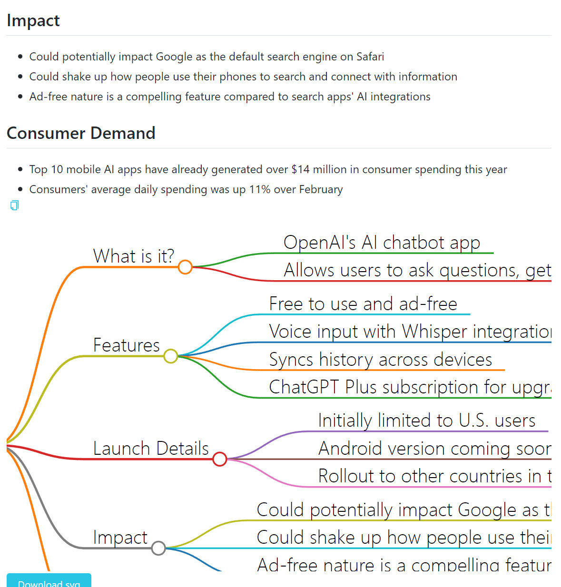

# VectorVein Workflow Tutorial

1. Create a new empty workflow and open the editing page.
2. Find the "Triggers > Button Trigger" node on the left and drag it onto the canvas.
3. Find the "Web Crawlers > Text Crawler" node on the left and drag it onto the canvas.
4. Find the "Outputs > Text" node on the left and drag it onto the canvas. Your canvas should look like this: 
5. The "Button Trigger" node only needs to be placed on the canvas, as it is a special node that does not need to be connected to other nodes.
6. Now, drag the Web page text output port of the "Text Crawler" node and connect it to the Text content port of the "Text" node. Your canvas should look like this: 
7. The "Text title" in the "Text" node is used to display the title in the user interface, and can be used to distinguish between multiple text contents to be presented.
8. Click the "Save" button and return to the user interface. Enter a website URL in the input box and click "Run" to see the crawler's results displayed on the right. This is a simple web crawler workflow: 
9. Go back to the editing page, double-click the connection to delete the connection. Find the "Text processing > Template compose" node and drag it onto the canvas. Click the "Add field" button in the Template compose node and add two variables, one with the display name of "Title" and the other with "Content". Then, drag the "Web page title" port of the "Text crawler" and connect it to the "Title" port of the "Template compose" node, and drag the "Web page text" port of the "Text crawler" and connect it to the "Text content" port of the "Template compose" node. Your canvas should look like this: 
10. In the template of the "Template compose" node, enter the following content. When the workflow is run, {{variable}} will be replaced with the content of the source port, and the synthesized template will be the output of the "Template compose" node.
```
"{{Title}}"
{{Content}}
---
Summarize the above article as a mind map and output it in Markdown format.
```
11. We will use the synthesized output as the prompt for the AI. Drag the "Language models > OpenAI" node onto the canvas, drag the output port of the "Template compose" node and connect it to the prompt port of the "OpenAI" node. Your canvas should look like this: 
12. Drag the "Outputs > Mindmap" node and connect the output of the OpenAI node to the text content port of the "Mindmap" node, and drag another line to connect it to the text content port of the "Text" node. Your canvas should look like this: 
13. Click the "Save" button and return to the user interface. Enter a website URL in the input box and click "Run" to see the results of the crawler summarized by the AI as a mind map displayed on the right. This is a simple web crawler + AI summary workflow: 