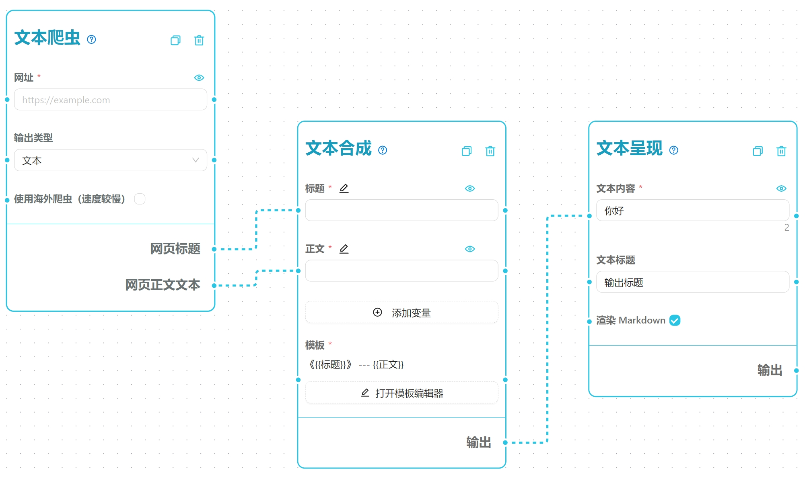
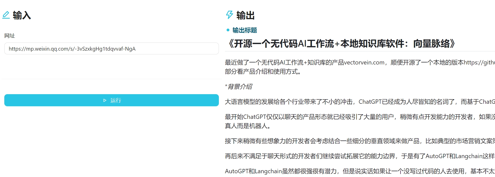
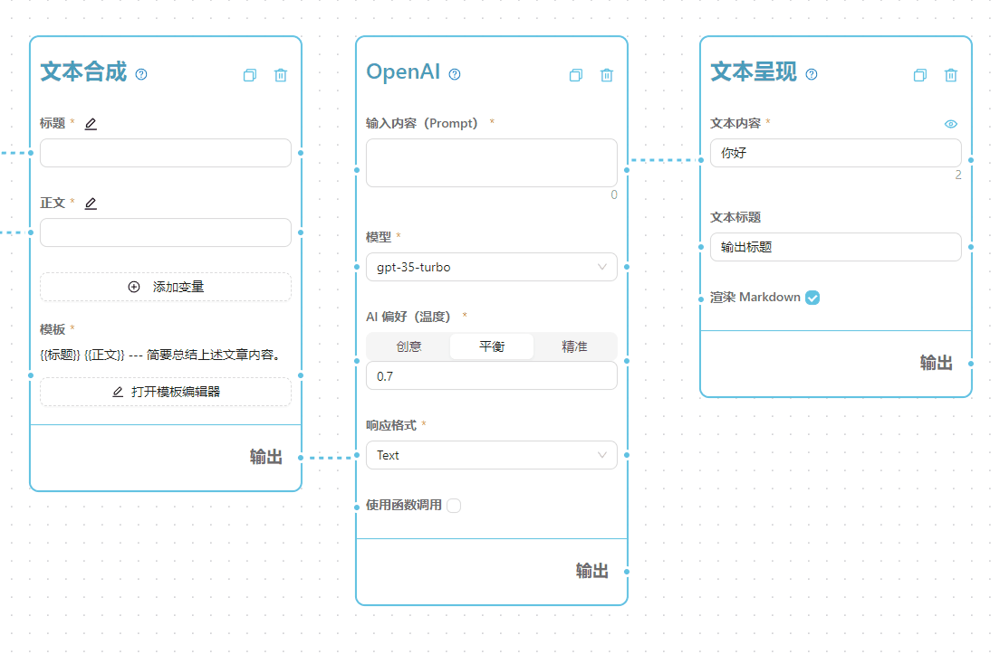
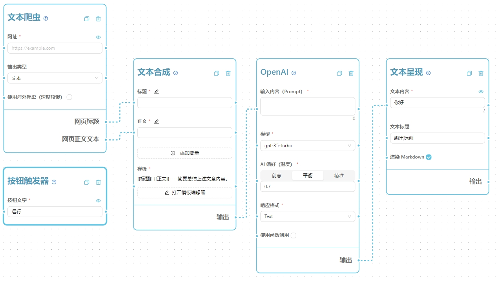
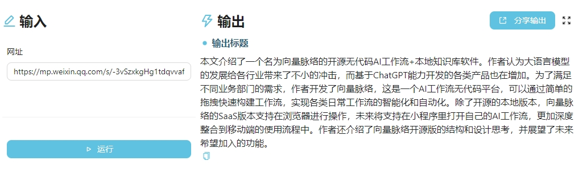
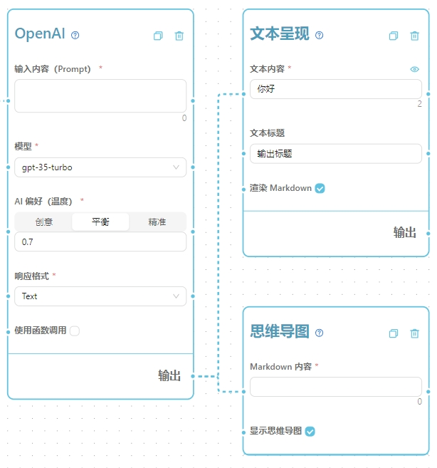
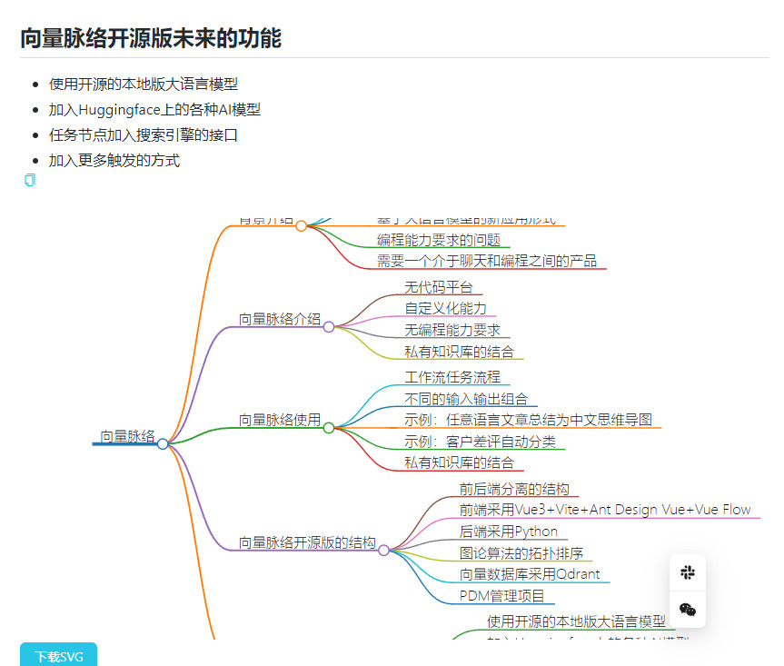
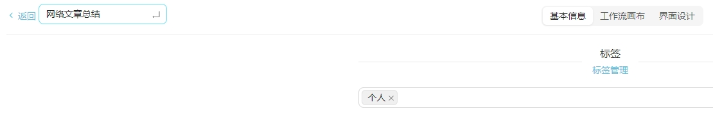

いくつかの既製のワークフローテンプレートを試した後、あなたは自分でワークフローを作成したいと思うかもしれません。このガイドはそのプロセスを支援します。

私たちのインタラクティブなチュートリアルを[オンラインで](https://vectorvein.com/workspace/workflow/tutorial)直接試すこともできます。

## ✌️ 全体的なアプローチ

#### UIデザイン

まず第一に、ワークフローを設計する際の目標は、将来の類似したプロセスをより効率的にすることです。したがって、ワークフローが実行されるたびにどの情報が変更される可能性があるかを考慮してください。これらの変更可能な情報を各ワークフロー実行の入力として抽出し、静的な情報は編集時にハードコーディングし、ユーザーインターフェースから隠すことができます。

以下の画像の左側のデザインは、テンプレート情報が一定で表示する必要がないため、右側よりも簡潔ではありません。


#### ワークフロー開発の哲学

ワークフローの設計を開始する際には、一度にすべてを行おうとしないでください。最初は数個のノードだけを含むシンプルなバージョンから始め、徐々に反復してください。いくつかのノードを追加して接続した後、問題がないかテストしてから続行することを忘れないでください。このアプローチは、開発プロセスの早い段階で問題を特定し、完了後に問題を見つけるよりも時間を節約できます。

## 🏫 迅速な開発チュートリアル

シンプルな**翻訳+AI要約マインドマップ**の例を使用して、ワークフローを迅速に開発する方法を示します。このチュートリアルを通じて、ワークフローエディタの基本的な使用方法といくつかの基本的な概念を学び、いくつかのベストプラクティスを紹介します。

1. 新しい空のワークフローを作成し、ワークフローの詳細ページで**その他の操作** -> **編集**をクリックしてエディタを開きます。

2. 左側のパネルから**トリガー > ボタントリガー**ノードをキャンバスにドラッグします。

3. 次に、**出力 > テキスト**ノードを見つけてキャンバスにドラッグします。

4. **テキスト**ノードのテキストコンテンツハンドルに「こんにちは」のようなメッセージを入力し、テキストタイトルハンドルに「出力タイトル」のようなタイトルを書きます。

この時点で、キャンバスは次のようになっているはずです：


> 注意：**ボタントリガー**は通常、キャンバスに配置するだけで十分です。これは他のノードに接続する必要がない特別なノードとして機能します。
>
> 注意：**テキスト**ノードの**テキストタイトル**は、ユーザーインターフェースに表示されるタイトルとして使用されます。複数のテキストコンテンツを表示する場合、このタイトルを使用して区別できます。

次に、**UIデザイン**をクリックしてユーザーインターフェースをプレビューします。トリガーエリアにボタンが表示され、出力エリアにテキストコンテンツが表示されることに気付くでしょう。次の画像のように：


次に、**ワークフローキャンバス**ページに戻り、左側のパネルから**テキスト処理 -> テンプレート合成**ノードを見つけてキャンバスにドラッグします。**テンプレート合成**ノードは、複数のテキストコンテンツを事前定義されたテンプレートに基づいて1つのテキストに結合します。キャンバスは次のようになっているはずです：


**テンプレート合成**ノードをクリックして変数を追加します。開いたドロワーで変数名「タイトル」を入力し、**追加**をクリックします。次に、別の変数名「本文」を入力し、入力タイプを複数行テキストボックスとして選択し、**追加**をクリックします。**テンプレート合成**ノードは次のようになっているはずです：


次に、テンプレートにいくつかの内容を書き込み、テキストを希望の形式に結合する方法を示します。テンプレートで変数を使用する場合、`{{変数名}}`の構文を使用します。たとえば、タイトルと本文を1つのテキストに結合するには、テンプレートを次のように書くことができます：

```
{{タイトル}}

---

{{本文}}
```

これにより、タイトルと本文が1つのテキストコンテンツに結合されます。**テンプレート合成**ノードは次のようになっているはずです：


> 注意：テンプレート内の変数名は、上で定義した変数名と一致する必要があります。そうしないと、結合が失敗します。
>
> ヒント：変数名をドラッグしてテンプレートに挿入できます。

次に、**テンプレート合成**ノードの出力ハンドルから**テキスト**ノードのテキストコンテンツハンドルに接続します。この接続は、**テンプレート合成**ノードで生成されたテキストコンテンツが**テキスト**ノードのテキストコンテンツハンドルに入力されることを示します。キャンバスは次のようになっているはずです：


次に、右側のタイトルと本文の**目**アイコンを有効にし、**保存**をクリックしてインターフェースに戻ります。入力ボックスにタイトルと本文を入力し、ワークフローを実行します。合成された結果が右側に表示されます。次の画像のように、これはシンプルなテンプレート合成ワークフローです。左側に入力したタイトルと本文がテンプレートの対応する位置に置き換えられ、1つのテキストコンテンツに結合され、右側のテキストコンテンツエリアに表示されます。


> 注意：よく見ると、**テキスト**ノードのテキストコンテンツハンドルには元々「こんにちは」という言葉が含まれていましたが、ワークフローを実行した後には表示されません。これは、**テンプレート合成**ノードの出力が**テキスト**ノードのテキストコンテンツハンドルに接続されているためです。ワークフローの実行時には、接続された出力の内容が優先され、接続がない場合にのみノード自体の内容が表示されます。

次に、ウェブスクレイピング機能を追加します。左側から**ウェブクローラー -> テキストクローラー**ノードを見つけてキャンバスにドラッグします。次に、**テキストクローラー**のウェブページタイトルとウェブページ本文テキストの出力を**テンプレート合成**ノードのタイトルと本文の入力にそれぞれ接続します。**テンプレート合成**ノードのタイトルと本文の**目**アイコンを無効にします。キャンバスは次のようになっているはずです：


**保存**ボタンをクリックしてインターフェースに戻り、入力ボックスにURLを入力します（例：[What is Azure OpenAI Service?](https://learn.microsoft.com/en-us/azure/ai-services/openai/overview)）を入力し、**実行**をクリックします。スクレイピングされたウェブページのタイトルと本文が右側に表示されます。次の画像のように、これはシンプルなテキストクローラーワークフローです。


編集ページを再度開きます。次に、テンプレート合成のテンプレートをAIプロンプトに変更する必要があります。**テンプレート合成**ノードのテンプレートを次の内容に変更します：

```markdown
# {{タイトル}}
{{本文}}

---

要約：
```

> 注意：ほとんどの場合、テンプレート合成を使用して自動化されたプロンプトテンプレートを作成し、AIモデルに生成させます。

次に、重要なAIコンポーネントを追加し、**AIモデル -> OpenAI**ノード（他のAIモデルも試してみてください）をフローにドラッグし、**テンプレート合成**と**テキスト**ノードの間に配置します。

次に、**テンプレート合成**から**テキスト**への接続を**OpenAI**ノードの入力プロンプトハンドルに変更する必要があります。接続を変更するには、カーソルを端点の近くに置き、カーソルが十字矢印に変わるのを待ち、左クリックを押し続けて接続を目的のハンドルにドラッグし、左クリックを離します。以下のビジュアルガイドを参照してください：


> 注意：接続を削除するには、接続を選択してキーボードのBackspaceキーを押します。

キャンバスノードが次のレイアウトに似ていることを確認し、ワークフローを保存してユーザーインターフェースに戻ります：


記事のURLを入力してワークフローを実行すると、AIが生成した記事の要約が表示されます。次の画像のように、これはAI生成の要約ワークフローの基本です。


> 注意：このシンプルなワークフローでは、長い記事に対する特定の処理は行っていないため、リンクされたコンテンツが長すぎると、AIモデルが処理できず、出力が表示されない場合があります。長い記事の処理に興味がある場合は、公式のワークフローテンプレートを確認してください。例：**🔀 任意の言語の記事を要約して日本語のマインドマップを生成**。

編集ページに戻り、ワークフローがMarkdownテキストとマインドマップの両方を出力するように拡張してみましょう。**出力 -> マインドマップ**ノードをフローにドラッグし、**OpenAI**ノードの出力ハンドルから新しいラインを**マインドマップ**ノードのMarkdownコンテンツハンドルに接続します。次のように：


AIモデルが階層的なマインドマップを生成できるようにするために、**テンプレート合成**ノードのテンプレート内容を次のように変更します：
```markdown
{{タイトル}}
{{本文}}

---

上記の記事を多層階のマインドマップに要約し、Markdown形式で日本語で出力してください。
```

> 注意：最適な出力を得るためには、テンプレート内容を何度も調整してテストする必要があるかもしれません。たとえば、ここでは「多層階」というキーワードを追加しました。これにより、AIモデルは階層的で多層階のマインドマップを出力する傾向があります。

保存してワークフローを再実行すると、AIが生成したMarkdown形式のマインドマップが表示されます。次の図のように、これはシンプルなクローラー+AIマインドマップのワークフローです。


設計されたワークフローについては、左上隅の名前、タグ、説明を変更して、将来のアクセスを容易にすることを忘れないでください。
